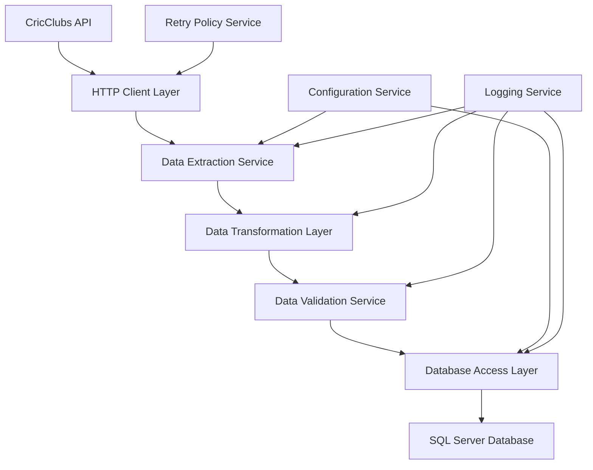

# Design Document

## Overview

The CricClubs Data Sync system is designed as a robust data pipeline that extracts cricket team and match information from CricClubs and stores it in a local SQL Server database. The system follows a layered architecture with clear separation of concerns, enabling reliable data synchronization while preparing for future API and UI development.

The design emphasizes data integrity, error resilience, and scalability to handle varying volumes of cricket data while maintaining performance and reliability.

## Architecture

### High-Level Architecture



### System Components

1. **HTTP Client Layer**: Manages communication with CricClubs API, handles authentication, rate limiting, and network resilience
2. **Data Extraction Service**: Orchestrates the download process, manages API calls, and coordinates data flow
3. **Data Transformation Layer**: Converts CricClubs data formats to internal models and handles data mapping
4. **Data Validation Service**: Ensures data integrity and completeness before database operations
5. **Database Access Layer**: Manages SQL Server connections, transactions, and CRUD operations
6. **Configuration Service**: Handles application settings, credentials, and synchronization parameters
7. **Logging Service**: Provides comprehensive logging and monitoring capabilities
8. **Retry Policy Service**: Implements resilient communication patterns with exponential backoff

## Components and Interfaces

### Core Interfaces

```csharp
public interface ICricClubsApiClient
{
    Task<List<Season>> GetSeasonsAsync();
    Task<List<Competition>> GetCompetitionsAsync(int seasonId);
    Task<List<Team>> GetTeamsAsync(int competitionId);
    Task<TeamDetailsResponse> GetTeamDetailsAsync(int teamId, int seasonId);
    Task<List<Player>> GetPlayersAsync(int teamId, int seasonId);
    Task<List<Match>> GetMatchesAsync(int competitionId, int? teamId = null);
    Task<MatchDetailsResponse> GetMatchDetailsAsync(int matchId);
    Task<InningsDetailsResponse> GetInningsDetailsAsync(int matchId, int inningsNumber);
    Task<List<BattingStatistic>> GetBattingStatsAsync(int matchId, int inningsNumber);
    Task<List<BowlingStatistic>> GetBowlingStatsAsync(int matchId, int inningsNumber);
    Task<PlayerCareerStatsResponse> GetPlayerCareerStatsAsync(int playerId, int seasonId);
}

public interface IDataSyncService
{
    Task<SyncResult> SyncSeasonsAsync();
    Task<SyncResult> SyncCompetitionsAsync(int seasonId);
    Task<SyncResult> SyncTeamsAsync(int competitionId);
    Task<SyncResult> SyncPlayersAsync(int teamId, int seasonId);
    Task<SyncResult> SyncMatchesAsync(int competitionId, SyncOptions options);
    Task<SyncResult> SyncMatchDetailsAsync(int matchId);
    Task<SyncResult> SyncPlayerStatsAsync(int playerId, int seasonId);
    Task<SyncResult> FullSeasonSyncAsync(int seasonId, SyncOptions options);
}

public interface IAnalyticsCalculationService
{
    Task CalculatePlayerCareerStatsAsync(int playerId, int seasonId);
    Task CalculateTeamStatsAsync(int teamId, int seasonId, int competitionId);
    Task RecalculateAllStatsAsync(int seasonId);
}

public interface ISeasonRepository
{
    Task<Season> GetByIdAsync(int id);
    Task<Season> GetByCricClubsIdAsync(int cricClubsId);
    Task<List<Season>> GetActiveAsync();
    Task<int> CreateAsync(Season season);
    Task UpdateAsync(Season season);
}

public interface ITeamRepository
{
    Task<Team> GetByIdAsync(int id);
    Task<Team> GetByCricClubsIdAsync(int cricClubsId);
    Task<List<Team>> GetByCompetitionAsync(int competitionId);
    Task<int> CreateAsync(Team team);
    Task UpdateAsync(Team team);
    Task<bool> ExistsAsync(int cricClubsId);
}

public interface IPlayerRepository
{
    Task<Player> GetByIdAsync(int id);
    Task<Player> GetByCricClubsIdAsync(int cricClubsId);
    Task<List<Player>> GetByTeamAsync(int teamId, int seasonId);
    Task<int> CreateAsync(Player player);
    Task UpdateAsync(Player player);
    Task<PlayerCareerStats> GetCareerStatsAsync(int playerId, int seasonId, string matchFormat);
}

public interface IMatchRepository
{
    Task<Match> GetByIdAsync(int id);
    Task<Match> GetByCricClubsIdAsync(int cricClubsId);
    Task<List<Match>> GetByCompetitionAsync(int competitionId, DateTime? fromDate = null);
    Task<List<Match>> GetByTeamAsync(int teamId, int seasonId);
    Task<int> CreateAsync(Match match);
    Task UpdateAsync(Match match);
}
```

### Configuration Model

```csharp
public class CricClubsConfig
{
    public string ApiBaseUrl { get; set; }
    public string Username { get; set; }
    public string Password { get; set; }
    public string ApiKey { get; set; } // CricClubs may use API keys
    public int RequestTimeoutSeconds { get; set; }
    public int MaxRetryAttempts { get; set; }
    public int RateLimitDelayMs { get; set; }
    public int MaxConcurrentRequests { get; set; } = 5;
}

public class SyncOptions
{
    public List<int> SeasonIds { get; set; }
    public List<int> CompetitionIds { get; set; }
    public List<int> TeamIds { get; set; }
    public DateTime? FromDate { get; set; }
    public DateTime? ToDate { get; set; }
    public bool IncludePlayerStats { get; set; } = true;
    public bool IncludeMatchDetails { get; set; } = true;
    public bool CalculateAnalytics { get; set; } = true;
    public bool SyncHistoricalData { get; set; } = false;
    public int BatchSize { get; set; } = 50;
    public List<string> MatchFormats { get; set; } = new List<string> { "T20", "ODI", "Test" };
}

public class AnalyticsConfig
{
    public bool AutoCalculatePlayerStats { get; set; } = true;
    public bool AutoCalculateTeamStats { get; set; } = true;
    public int MinimumInningsForAverage { get; set; } = 3;
    public int MinimumOversForBowlingAverage { get; set; } = 10;
    public bool IncludeNotOutInAverage { get; set; } = true;
}
```

## Data Models

### Database Schema

```sql
-- Seasons table (CricClubs organizes data by seasons)
CREATE TABLE Seasons (
    Id INT IDENTITY(1,1) PRIMARY KEY,
    CricClubsId INT UNIQUE NOT NULL,
    Name NVARCHAR(255) NOT NULL,
    StartDate DATETIME2 NOT NULL,
    EndDate DATETIME2 NOT NULL,
    IsActive BIT DEFAULT 0,
    CreatedAt DATETIME2 DEFAULT GETUTCDATE(),
    UpdatedAt DATETIME2 DEFAULT GETUTCDATE()
);

-- Competitions/Leagues table
CREATE TABLE Competitions (
    Id INT IDENTITY(1,1) PRIMARY KEY,
    CricClubsId INT UNIQUE NOT NULL,
    SeasonId INT FOREIGN KEY REFERENCES Seasons(Id),
    Name NVARCHAR(255) NOT NULL,
    CompetitionType NVARCHAR(50), -- League, Tournament, Friendly
    MatchFormat NVARCHAR(20), -- T20, ODI, Test, etc.
    CreatedAt DATETIME2 DEFAULT GETUTCDATE(),
    UpdatedAt DATETIME2 DEFAULT GETUTCDATE()
);

-- Teams table
CREATE TABLE Teams (
    Id INT IDENTITY(1,1) PRIMARY KEY,
    CricClubsId INT UNIQUE NOT NULL,
    Name NVARCHAR(255) NOT NULL,
    ShortName NVARCHAR(50),
    HomeGround NVARCHAR(255),
    ContactEmail NVARCHAR(255),
    ContactPhone NVARCHAR(50),
    ClubAffiliation NVARCHAR(255),
    CreatedAt DATETIME2 DEFAULT GETUTCDATE(),
    UpdatedAt DATETIME2 DEFAULT GETUTCDATE(),
    LastSyncAt DATETIME2
);

-- Players table
CREATE TABLE Players (
    Id INT IDENTITY(1,1) PRIMARY KEY,
    CricClubsId INT UNIQUE NOT NULL,
    FirstName NVARCHAR(100) NOT NULL,
    LastName NVARCHAR(100) NOT NULL,
    DateOfBirth DATE,
    Role NVARCHAR(50), -- Batsman, Bowler, All-rounder, Wicket-keeper
    BattingStyle NVARCHAR(50), -- Right-hand, Left-hand
    BowlingStyle NVARCHAR(50), -- Right-arm fast, Left-arm spin, etc.
    IsActive BIT DEFAULT 1,
    CreatedAt DATETIME2 DEFAULT GETUTCDATE(),
    UpdatedAt DATETIME2 DEFAULT GETUTCDATE()
);

-- Team-Player relationships (players can play for multiple teams across seasons)
CREATE TABLE TeamPlayers (
    Id INT IDENTITY(1,1) PRIMARY KEY,
    TeamId INT FOREIGN KEY REFERENCES Teams(Id),
    PlayerId INT FOREIGN KEY REFERENCES Players(Id),
    SeasonId INT FOREIGN KEY REFERENCES Seasons(Id),
    JerseyNumber INT,
    IsCaptain BIT DEFAULT 0,
    IsViceCaptain BIT DEFAULT 0,
    IsWicketKeeper BIT DEFAULT 0,
    JoinDate DATETIME2,
    LeaveDate DATETIME2,
    UNIQUE(TeamId, PlayerId, SeasonId)
);

-- Matches table
CREATE TABLE Matches (
    Id INT IDENTITY(1,1) PRIMARY KEY,
    CricClubsId INT UNIQUE NOT NULL,
    CompetitionId INT FOREIGN KEY REFERENCES Competitions(Id),
    HomeTeamId INT FOREIGN KEY REFERENCES Teams(Id),
    AwayTeamId INT FOREIGN KEY REFERENCES Teams(Id),
    MatchDate DATETIME2 NOT NULL,
    Venue NVARCHAR(255),
    MatchType NVARCHAR(20), -- T20, ODI, Test, etc.
    Status NVARCHAR(50), -- Scheduled, InProgress, Completed, Cancelled
    TossWinner INT FOREIGN KEY REFERENCES Teams(Id),
    TossDecision NVARCHAR(20), -- Bat, Bowl
    Result NVARCHAR(500),
    WinnerTeamId INT FOREIGN KEY REFERENCES Teams(Id),
    WinMargin NVARCHAR(100), -- "5 wickets", "23 runs", etc.
    MatchOfficials NVARCHAR(500),
    WeatherConditions NVARCHAR(255),
    PitchConditions NVARCHAR(255),
    CreatedAt DATETIME2 DEFAULT GETUTCDATE(),
    UpdatedAt DATETIME2 DEFAULT GETUTCDATE(),
    LastSyncAt DATETIME2
);

-- Innings table (each match can have multiple innings)
CREATE TABLE Innings (
    Id INT IDENTITY(1,1) PRIMARY KEY,
    MatchId INT FOREIGN KEY REFERENCES Matches(Id),
    TeamId INT FOREIGN KEY REFERENCES Teams(Id),
    InningsNumber INT NOT NULL, -- 1st, 2nd, 3rd, 4th
    TotalRuns INT DEFAULT 0,
    TotalWickets INT DEFAULT 0,
    TotalOvers DECIMAL(4,1) DEFAULT 0,
    TotalBalls INT DEFAULT 0,
    Extras INT DEFAULT 0,
    Byes INT DEFAULT 0,
    LegByes INT DEFAULT 0,
    Wides INT DEFAULT 0,
    NoBalls INT DEFAULT 0,
    Penalties INT DEFAULT 0,
    IsDeclared BIT DEFAULT 0,
    IsFollowOn BIT DEFAULT 0,
    CreatedAt DATETIME2 DEFAULT GETUTCDATE()
);

-- Batting Statistics (individual batting performances)
CREATE TABLE BattingStatistics (
    Id INT IDENTITY(1,1) PRIMARY KEY,
    InningsId INT FOREIGN KEY REFERENCES Innings(Id),
    PlayerId INT FOREIGN KEY REFERENCES Players(Id),
    BattingOrder INT NOT NULL,
    RunsScored INT DEFAULT 0,
    BallsFaced INT DEFAULT 0,
    Fours INT DEFAULT 0,
    Sixes INT DEFAULT 0,
    StrikeRate DECIMAL(6,2) DEFAULT 0,
    DismissalType NVARCHAR(50), -- Bowled, Caught, LBW, Run Out, etc.
    BowlerPlayerId INT FOREIGN KEY REFERENCES Players(Id), -- Who got them out
    FielderPlayerId INT FOREIGN KEY REFERENCES Players(Id), -- Who caught/ran them out
    IsNotOut BIT DEFAULT 0,
    MinutesAtCrease INT DEFAULT 0,
    CreatedAt DATETIME2 DEFAULT GETUTCDATE()
);

-- Bowling Statistics (individual bowling performances)
CREATE TABLE BowlingStatistics (
    Id INT IDENTITY(1,1) PRIMARY KEY,
    InningsId INT FOREIGN KEY REFERENCES Innings(Id),
    PlayerId INT FOREIGN KEY REFERENCES Players(Id),
    BowlingOrder INT, -- Order in which they bowled
    OversBowled DECIMAL(4,1) DEFAULT 0,
    MaidenOvers INT DEFAULT 0,
    RunsConceded INT DEFAULT 0,
    WicketsTaken INT DEFAULT 0,
    Economy DECIMAL(4,2) DEFAULT 0,
    Wides INT DEFAULT 0,
    NoBalls INT DEFAULT 0,
    CreatedAt DATETIME2 DEFAULT GETUTCDATE()
);

-- Fielding Statistics
CREATE TABLE FieldingStatistics (
    Id INT IDENTITY(1,1) PRIMARY KEY,
    MatchId INT FOREIGN KEY REFERENCES Matches(Id),
    PlayerId INT FOREIGN KEY REFERENCES Players(Id),
    Catches INT DEFAULT 0,
    Stumpings INT DEFAULT 0,
    RunOuts INT DEFAULT 0,
    DroppedCatches INT DEFAULT 0,
    CreatedAt DATETIME2 DEFAULT GETUTCDATE()
);

-- Player Career Statistics (aggregated analytics data)
CREATE TABLE PlayerCareerStats (
    Id INT IDENTITY(1,1) PRIMARY KEY,
    PlayerId INT FOREIGN KEY REFERENCES Players(Id),
    SeasonId INT FOREIGN KEY REFERENCES Seasons(Id),
    MatchFormat NVARCHAR(20), -- T20, ODI, Test
    
    -- Batting Stats
    MatchesPlayed INT DEFAULT 0,
    InningsPlayed INT DEFAULT 0,
    NotOuts INT DEFAULT 0,
    TotalRuns INT DEFAULT 0,
    HighestScore INT DEFAULT 0,
    BattingAverage DECIMAL(6,2) DEFAULT 0,
    BattingStrikeRate DECIMAL(6,2) DEFAULT 0,
    Centuries INT DEFAULT 0,
    HalfCenturies INT DEFAULT 0,
    Fours INT DEFAULT 0,
    Sixes INT DEFAULT 0,
    
    -- Bowling Stats
    BowlingInnings INT DEFAULT 0,
    OversBowled DECIMAL(8,1) DEFAULT 0,
    RunsConceded INT DEFAULT 0,
    WicketsTaken INT DEFAULT 0,
    BowlingAverage DECIMAL(6,2) DEFAULT 0,
    BowlingStrikeRate DECIMAL(6,2) DEFAULT 0,
    Economy DECIMAL(4,2) DEFAULT 0,
    BestBowlingFigures NVARCHAR(20),
    FiveWicketHauls INT DEFAULT 0,
    
    -- Fielding Stats
    TotalCatches INT DEFAULT 0,
    TotalStumpings INT DEFAULT 0,
    TotalRunOuts INT DEFAULT 0,
    
    LastUpdated DATETIME2 DEFAULT GETUTCDATE(),
    UNIQUE(PlayerId, SeasonId, MatchFormat)
);

-- Team Statistics (for team analytics)
CREATE TABLE TeamStats (
    Id INT IDENTITY(1,1) PRIMARY KEY,
    TeamId INT FOREIGN KEY REFERENCES Teams(Id),
    SeasonId INT FOREIGN KEY REFERENCES Seasons(Id),
    CompetitionId INT FOREIGN KEY REFERENCES Competitions(Id),
    MatchesPlayed INT DEFAULT 0,
    MatchesWon INT DEFAULT 0,
    MatchesLost INT DEFAULT 0,
    MatchesDrawn INT DEFAULT 0,
    MatchesTied INT DEFAULT 0,
    WinPercentage DECIMAL(5,2) DEFAULT 0,
    TotalRunsScored INT DEFAULT 0,
    TotalRunsConceded INT DEFAULT 0,
    HighestTeamScore INT DEFAULT 0,
    LowestTeamScore INT DEFAULT 0,
    AverageScore DECIMAL(6,2) DEFAULT 0,
    LastUpdated DATETIME2 DEFAULT GETUTCDATE(),
    UNIQUE(TeamId, SeasonId, CompetitionId)
);
```

### Domain Models

```csharp
public class Season
{
    public int Id { get; set; }
    public int CricClubsId { get; set; }
    public string Name { get; set; }
    public DateTime StartDate { get; set; }
    public DateTime EndDate { get; set; }
    public bool IsActive { get; set; }
    public List<Competition> Competitions { get; set; } = new List<Competition>();
}

public class Competition
{
    public int Id { get; set; }
    public int CricClubsId { get; set; }
    public int SeasonId { get; set; }
    public string Name { get; set; }
    public string CompetitionType { get; set; }
    public string MatchFormat { get; set; }
    public List<Team> Teams { get; set; } = new List<Team>();
    public List<Match> Matches { get; set; } = new List<Match>();
}

public class Team
{
    public int Id { get; set; }
    public int CricClubsId { get; set; }
    public string Name { get; set; }
    public string ShortName { get; set; }
    public string HomeGround { get; set; }
    public string ContactEmail { get; set; }
    public string ContactPhone { get; set; }
    public string ClubAffiliation { get; set; }
    public DateTime CreatedAt { get; set; }
    public DateTime UpdatedAt { get; set; }
    public DateTime? LastSyncAt { get; set; }
}

public class Player
{
    public int Id { get; set; }
    public int CricClubsId { get; set; }
    public string FirstName { get; set; }
    public string LastName { get; set; }
    public DateTime? DateOfBirth { get; set; }
    public string Role { get; set; }
    public string BattingStyle { get; set; }
    public string BowlingStyle { get; set; }
    public bool IsActive { get; set; }
    public List<PlayerCareerStats> CareerStats { get; set; } = new List<PlayerCareerStats>();
}

public class Match
{
    public int Id { get; set; }
    public int CricClubsId { get; set; }
    public int CompetitionId { get; set; }
    public int HomeTeamId { get; set; }
    public int AwayTeamId { get; set; }
    public DateTime MatchDate { get; set; }
    public string Venue { get; set; }
    public string MatchType { get; set; }
    public string Status { get; set; }
    public int? TossWinner { get; set; }
    public string TossDecision { get; set; }
    public string Result { get; set; }
    public int? WinnerTeamId { get; set; }
    public string WinMargin { get; set; }
    public string MatchOfficials { get; set; }
    public string WeatherConditions { get; set; }
    public string PitchConditions { get; set; }
    public List<Innings> Innings { get; set; } = new List<Innings>();
}

public class Innings
{
    public int Id { get; set; }
    public int MatchId { get; set; }
    public int TeamId { get; set; }
    public int InningsNumber { get; set; }
    public int TotalRuns { get; set; }
    public int TotalWickets { get; set; }
    public decimal TotalOvers { get; set; }
    public int TotalBalls { get; set; }
    public int Extras { get; set; }
    public bool IsDeclared { get; set; }
    public List<BattingStatistic> BattingStats { get; set; } = new List<BattingStatistic>();
    public List<BowlingStatistic> BowlingStats { get; set; } = new List<BowlingStatistic>();
}

public class BattingStatistic
{
    public int Id { get; set; }
    public int InningsId { get; set; }
    public int PlayerId { get; set; }
    public int BattingOrder { get; set; }
    public int RunsScored { get; set; }
    public int BallsFaced { get; set; }
    public int Fours { get; set; }
    public int Sixes { get; set; }
    public decimal StrikeRate { get; set; }
    public string DismissalType { get; set; }
    public int? BowlerPlayerId { get; set; }
    public int? FielderPlayerId { get; set; }
    public bool IsNotOut { get; set; }
    public int MinutesAtCrease { get; set; }
}

public class BowlingStatistic
{
    public int Id { get; set; }
    public int InningsId { get; set; }
    public int PlayerId { get; set; }
    public int? BowlingOrder { get; set; }
    public decimal OversBowled { get; set; }
    public int MaidenOvers { get; set; }
    public int RunsConceded { get; set; }
    public int WicketsTaken { get; set; }
    public decimal Economy { get; set; }
    public int Wides { get; set; }
    public int NoBalls { get; set; }
}

public class PlayerCareerStats
{
    public int Id { get; set; }
    public int PlayerId { get; set; }
    public int SeasonId { get; set; }
    public string MatchFormat { get; set; }
    
    // Batting Analytics
    public int MatchesPlayed { get; set; }
    public int InningsPlayed { get; set; }
    public int NotOuts { get; set; }
    public int TotalRuns { get; set; }
    public int HighestScore { get; set; }
    public decimal BattingAverage { get; set; }
    public decimal BattingStrikeRate { get; set; }
    public int Centuries { get; set; }
    public int HalfCenturies { get; set; }
    
    // Bowling Analytics
    public int BowlingInnings { get; set; }
    public decimal OversBowled { get; set; }
    public int RunsConceded { get; set; }
    public int WicketsTaken { get; set; }
    public decimal BowlingAverage { get; set; }
    public decimal BowlingStrikeRate { get; set; }
    public decimal Economy { get; set; }
    public string BestBowlingFigures { get; set; }
    public int FiveWicketHauls { get; set; }
    
    // Fielding Analytics
    public int TotalCatches { get; set; }
    public int TotalStumpings { get; set; }
    public int TotalRunOuts { get; set; }
}
```

## Error Handling

### Error Categories and Strategies

1. **Network Errors**
   - Implement exponential backoff with jitter
   - Maximum retry attempts: 3
   - Timeout handling with configurable limits
   - Circuit breaker pattern for persistent failures

2. **API Errors**
   - Rate limit handling with respect to CricClubs limits
   - Authentication token refresh mechanism
   - Graceful degradation for partial API failures
   - Detailed error logging with API response codes

3. **Data Validation Errors**
   - Field-level validation with specific error messages
   - Data type conversion error handling
   - Missing required field detection
   - Referential integrity validation

4. **Database Errors**
   - Transaction rollback on batch operation failures
   - Deadlock detection and retry logic
   - Connection pool management
   - Constraint violation handling

### Error Recovery Mechanisms

```csharp
public class SyncResult
{
    public bool IsSuccess { get; set; }
    public int TotalRecordsProcessed { get; set; }
    public int SuccessfulRecords { get; set; }
    public int FailedRecords { get; set; }
    public List<SyncError> Errors { get; set; } = new List<SyncError>();
    public TimeSpan Duration { get; set; }
    public DateTime StartTime { get; set; }
    public DateTime EndTime { get; set; }
}

public class SyncError
{
    public string ErrorType { get; set; }
    public string Message { get; set; }
    public string Details { get; set; }
    public DateTime Timestamp { get; set; }
    public string RecordIdentifier { get; set; }
}
```

## Testing Strategy

### Unit Testing
- Repository pattern testing with in-memory database
- Service layer testing with mocked dependencies
- Data transformation logic validation
- Configuration validation testing

### Integration Testing
- Database integration tests with test containers
- API client integration tests with mock CricClubs endpoints
- End-to-end sync process testing
- Error scenario simulation and recovery testing

### Performance Testing
- Large dataset synchronization performance
- Concurrent operation handling
- Memory usage optimization validation
- Database query performance testing

### Test Data Management
- Synthetic cricket data generation for testing
- Test database seeding and cleanup
- Mock CricClubs API responses
- Edge case data scenario coverage